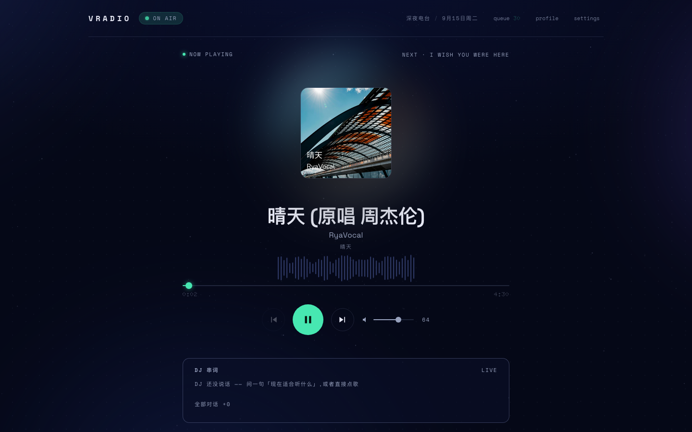
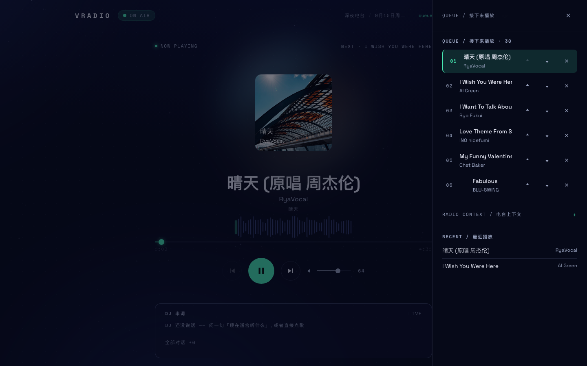
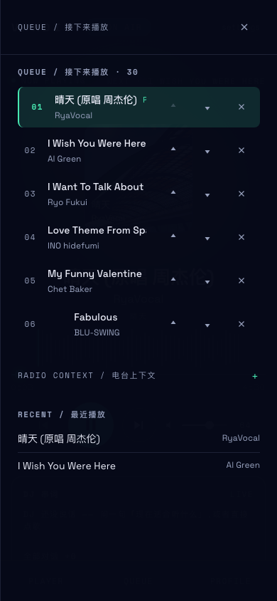

# Vradio — 个人 AI 电台

> 你对它说话,它读懂你的品味、作息、日程与天气,用 Claude 编排一场只属于你的电台直播。
> DJ 串词由 Fish Audio 合成语音,歌曲经网易云解析播放,推送到浏览器 PWA 或家里的 UPnP 音响。

深墨蓝的夜间电波控制台,薄荷绿 `#47e7b1` 是唯一的"信号灯",象牙白的实体播放控制台是唯一的亮色大块——设计语言取自 Nothing 的克制与点阵气质。

[](https://github.com/h4v1er/Vradio/actions/workflows/ci.yml)

## 四层架构

```
┌─ ① 输入与外部能力 ──────────────────────────────────────────┐
│ user/ 语料(taste/routines/playlists/mood-rules,可在线编辑)   │
│ Claude Code 子进程(claude -p --output-format json)           │
│ NeteaseCloudMusicApi(Docker :3000)                           │
│ Fish Audio TTS / Feishu 日程 / OpenWeather / UPnP            │
└───────────────────────┬─────────────────────────────────────┘
┌─ ② Node.js 本地服务(:8080)─▼───────────────────────────────┐
│ router.js 意图分流(控制/点歌直达/自然语言)                   │
│ context.js 六片段提示词组装    claude.js 大脑适配器(互斥/超时)│
│ scheduler.js 节奏调度(cron + 日历 hook)                      │
│ tts.js 语音合成与哈希缓存      adapters/(netease/fish/…)     │
│ state.db(SQLite:消息/播放/计划/偏好/播放器状态)              │
└───────────────────────┬─────────────────────────────────────┘
┌─ ③ Context Window ───▼─────────────────────────────────────┐
│ DJ 人设 + 品味语料 + 天气/日程/时间注入 + 记忆 + 本次输入     │
│ + 执行轨迹 → Claude 输出 { say, play[], reason, segue }      │
└───────────────────────┬─────────────────────────────────────┘
┌─ ④ PWA 播放器(:5173)─▼─────────────────────────────────────┐
│ Vue3 + Vite · 单一 <audio> · WS /stream 实时流               │
│ Player / Queue / Profile / Settings · Service Worker 缓存    │
└─────────────────────────────────────────────────────────────┘
```

核心原则:**本地服务是播放状态的唯一拥有者**;用户语料、日程、外部 API 返回只作为数据注入,永不当作指令执行;每个外部依赖都适配器化,缺 key / 服务宕机时优雅降级,不阻塞核心听歌链路。

## 快速开始

前置:Node.js ≥ 22、Docker(或原生运行 NeteaseCloudMusicApi)、Claude Code CLI 已登录。

```bash
# 一条命令启动:网易云 API 容器(:3000)+ 本地服务(:8080)+ PWA 前端(:5173)
bash scripts/dev.sh
```

浏览器打开 http://localhost:5173,说"早上好,今天适合听什么?"——DJ 会结合天气、日程与你的品味编排串词与队列。

### 测试与评测

```bash
# 后端自动化测试(node:test,全部 mock/桩件,无需任何密钥、网络或容器)
cd server && npm test

# 评测集(fixture 模式默认:不产生真实模型调用与费用;24 条用例覆盖
# 正常场景/点歌/提示注入/格式错误/外部服务故障)
cd server && npm run eval

# 前端构建验证
cd frontend && npm run build
```

CI(GitHub Actions,`.github/workflows/ci.yml`)在每次 push / PR 时执行上述 server 测试+评测与 frontend 构建,不需要任何真实 API Key。

外部服务密钥(可选,全部可降级):

```bash
cp server/.env.example server/.env   # 填入 FISH_API_KEY / OPENWEATHER_API_KEY / FEISHU_APP_ID …
```

也可在设置页「capabilities / 外部能力」直接粘贴保存——保存前会先验证(Fish/飞书无效不落库,OpenWeather 新 key 未激活会如实提示)。

**凭据存储说明(如实)**:本项目是**本地单用户应用**,密钥保存在本机 `state.db`(已 gitignore 的 SQLite)中,为**本地明文存储**——威胁模型仅覆盖「密钥不进仓库、不上传、接口不回显」,不覆盖「能读取你本机文件的进程」。这不是密钥管理系统,请勿宣传为「安全密钥治理」。风险与改进方向(系统钥匙串/凭据库)见 [docs/FAILURE-MODES.md](docs/FAILURE-MODES.md)。

网易云 Cookie 与歌单(可选,推荐):

- **Cookie**:设置页 →「netease / 网易云账户与歌单」粘贴 `MUSIC_U=…`(登录 music.163.com 后从浏览器开发者工具导出)。保存前会先验证登录态,有效才写入本机 `state.db`(已 gitignore,不上传;与密钥一样为本地明文,风险见上)。配置后 VIP/会员歌曲按**你自己账号的权益**播放(会员可完整播放);也可放 `server/.env` 的 `NETEASE_COOKIE`(环境变量优先)。
- **不做绕过**:本项目不提供任何绕过第三方音乐服务版权/会员限制的能力。未登录时 VIP 歌曲仅 30 秒试听(平台策略,播放器与串词如实标注)。
- **导入歌单**:同一面板粘贴歌单链接或 ID(公开歌单无需登录),曲目清单落库后注入 DJ 提示词——DJ 会把它当作你最可信的品味信号,选歌优先从中取材;配置 Cookie 后还可一键拉取「我的歌单」。

## API 契约

| 接口 | 职责 |
|---|---|
| `POST /api/chat` | 意图分流:控制指令直接执行;点歌直达网易云;自然语言走 Claude 编排,返回 `{say, play[], reason, segue, tts}` |
| `GET /api/now` | 当前播放 + 队列 + DJ 状态 |
| `GET /api/next` | 下一首 / 当前队列 |
| `GET /api/plays/today` | 当日播放记录(state.db) |
| `GET /api/plan/today` · `POST /api/plan/generate` | 当日播放计划(scheduler 生成/手动触发) |
| `POST /api/queue/play` · `remove` · `move` · `clear` | 队列操作(点击/移除/拖拽排序) |
| `GET /api/user/files` · `POST /api/user/files` | Profile 页在线编辑品味语料(白名单校验) |
| `GET /api/env` · `GET /api/config` · `POST /api/config/secrets` · `POST /api/config/secrets/clear` | 天气/日程快照;外部能力配置状态与设置页保存密钥(验证后落 state.db,不暴露密钥值) |
| `GET /api/upnp/devices` · `POST /api/upnp/select·cast·control` | SSDP 发现 + 投放/控制家庭音响 |
| `GET /api/stream/:songId` | 音频流代理(音质逐级回退、Range 206、上游 CDN 要求的 Referer/UA 头) |
| `GET/POST /api/netease/cookie` · `POST /api/netease/cookie/clear` | 网易云 Cookie 状态/保存(先验证再落库)/清除 |
| `GET /api/netease/my-playlists` | 登录后自己的歌单(需有效 Cookie) |
| `POST /api/netease/playlist/import` · `GET /api/netease/playlists` · `POST /api/netease/playlist/remove` | 导入歌单(公开歌单免登录)/已导入列表/移除,DJ 提示词注入 |
| `WS /stream` | 推送 `chat` / `now-playing` / `dj` / `tts` / `plan` / `upnp` 事件 |
| `GET /tts/[hash].mp3` | TTS 缓存音频(Fish Audio,文本哈希去重) |

## 降级矩阵

以下行为均有自动化测试或评测用例背书(单测 `server/test/`,评测 `server/evals/`,逐项证据见 [docs/FAILURE-MODES.md](docs/FAILURE-MODES.md))。

| 故障 | 表现 |
|---|---|
| Claude 子进程失败/超时 | 点歌类按关键词直搜网易云;其余返回"电台信号不太好",`degraded: true` |
| 网易云容器宕机 | 点歌/DJ 编排均降级为信号提示,播放状态机不受影响;容器恢复后下次请求自动恢复,无需重启 |
| VIP/会员歌曲未登录 | 仅 30 秒试听,串词与播放器如实标注;设置页配置网易云 Cookie(或 `server/.env` 配 `NETEASE_COOKIE`)后完整播放 |
| 网易云 Cookie 失效 | 保存时 `/login/status` 验证拦截,无效不落库;清除后回退匿名访问 |
| Fish Audio 未配置 | `tts: null`,串词纯文字展示 |
| 天气/飞书未配置或失败 | 环境注入"未配置/暂不可用"标记,DJ 串词自然跳过 |
| UPnP 无设备 | 设备列表为空,UI 置灰并给出重扫入口 |
| WS 断线 | 前端指数退避重连,ON AIR 变灰 OFFLINE;请求走 HTTP 兜底 |
| 断网(PWA) | Service Worker 缓存静态资源,壳可打开,恢复后自动重连 |

## 设计令牌(前端)

`frontend/src/styles/tokens.css` 统一管理,组件内不硬编码:

```
背景 #07090d  表面 #0e1218 / #151b22  正文 #f1f1eb  次要 #8d96a3
状态 薄荷绿 #47e7b1   AI 淡紫 #9a72ff   控制台 象牙白 #ece9df / 墨 #0a0d0b
字体 Space Grotesk / Space Mono / Doto(自托管)+ PingFang SC 回退
动效 160–220ms;唯一持续动效 = 星尘漂移 / ON AIR 呼吸 / 波形,reduced-motion 全停
```

## 目录结构

```
server/      本地服务:router.js · context.js · claude.js · scheduler.js · tts.js · player.js
             adapters/(netease · feishu · weather · upnp) · user/ 品味语料 · prompts/ DJ 人设
             test/ 自动化测试(node:test,全部 mock) · evals/ 评测集(jsonl 用例 + 运行器)
frontend/    Vue3 PWA:features/(player · queue · dj · radio-context · profile · settings)
             stores/ · lib/api · styles/ tokens.css · scripts/gen-icons.js
scripts/     dev.sh 一键启动
docs/        FAILURE-MODES.md 故障模式与降级证据 · assets/ 实机截图
.github/     workflows/ci.yml(push/PR 跑 server 测试+评测、frontend 构建,无需密钥)
```

## 截图

> 实机运行截图(本机 dev 环境,非设计稿)。复现:`bash scripts/dev.sh` → 打开 http://localhost:5173 → 说"播放 晴天" → 按 1440px / 390px 视口截图。

**桌面 1440px**(主界面 / 队列抽屉展开)




**移动 390px**(主界面 / 队列页)




## 已知限制

- **单用户本地应用**:无账号体系与多用户隔离;若未来做多用户/部署版,需重做鉴权,密钥治理升级为系统钥匙串(评估见 [docs/FAILURE-MODES.md](docs/FAILURE-MODES.md))。
- **依赖 Claude Code CLI 本机登录**:大脑是 `claude -p` 子进程,运行机器需已登录 Claude Code(Max 订阅);测试与 CI 不调用真实模型。
- **凭据本地明文存储**:Fish/天气/飞书密钥与网易云 Cookie 存于本机 SQLite(已 gitignore)。威胁模型仅覆盖「不进仓库、不上传、接口不回显」,不覆盖能读取本机文件的进程。
- **版权受限歌曲**:部分歌曲无播放直链或未登录仅 30 秒试听,播放器与串词如实标注,不做任何绕过(平台策略,非本项目限制)。
- **部分失败路径仅手动验证**:UPnP、音频流代理、TTS 合成失败、Cookie 失效依赖真实设备/服务,无自动化测试,验证方法见 [docs/FAILURE-MODES.md](docs/FAILURE-MODES.md)。
- **响应式断点**:桌面(12 栏)与移动(<768px 单栏)两档;中间宽度未逐档验证。

## License

MIT
